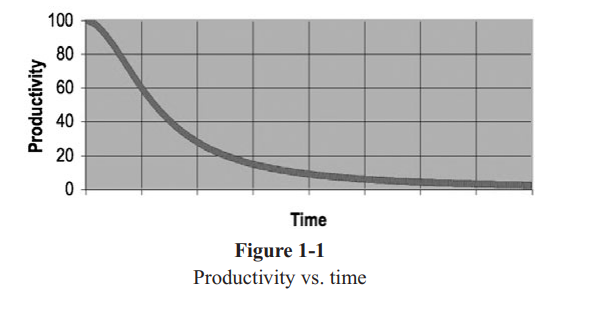

# Chapter 1. Clean Code

### Introduction

- 아래 그림은 **좋은 코드** 와 **나쁜 코드** 를 구분짓는 유명한 그림이다.
- WTFs / min 🤣


- 책은 크게 세 파트로 나뉜다.
  - Part 1. 클린코드를 쓰는 주요 원리, 패턴, 실습 등
  - Part 2. 복잡한 코드로 이루어진 Case Study 를 통해 문제가 있는 코드들을 확인. 
  - Part 3. Case Study 에 대한 휴리스틱으로 코드를 조금씩 고쳐본다. (완벽한 코드 x. 실현가능한 해결방법을 적용)


> 우리가 이 책을 읽는 이유 : **더 나은 프로그래머** 가 되기 위해서...


### There Will Be Code 코드가 있을지어다

- 명세서를 기반으로 프로그램을 자동으로 생산해낼거라는 생각은 틀렸다.
- 우리 의도나 생각을 정확하게 이해해서 프로그램을 만들어주는 기계가 나올거라는데, 그런 일은 일어나지 않을 거다.

### Bad Code 나쁜 코드

- 80년대 후반 killer app 을 유명한 회사가 있었다. 하지만 짧은시간 안에 곧 망했다.
  - 20여년 후 그 회사 직원으로부터 이유를 들을 수 있었다. 
  - 많은 기능을 추가함에 따라서 코드를 관리하기가 어려워졌다.
  - 결국 나쁜 코드가 회사를 망하게 한 것이다.
- `Wading` . Wade through bad code. 나쁜 코드 사이를 헤매고 있다.
- 나중에 고쳐야지~ 나중에 손봐야지~ 하는 코드를 우리는 절대 고치지 않는다.
- **르블랑의 법칙 : 나중은 결코 오지 않는다. **

### The Total Cost of Owning a Mess 엉망진창인 것을 소유하는데 드는 총비용

- 프로젝트 초기에는 매우 빠른속도로 업무가 수행되지만 시간이 지나면서 페이스가 느려지는 것을 볼 수 있다.
- 또한 코드가 점점 복잡해지고 시간이 지남에 따라, 더욱더 엉망진창이 되어 코드를 깨끗하게 할 방법이 전혀 없어진다.
- 나쁜 코드가 쌓이면 쌓일수록 이들의 생산성(productivity)은 떨어지고 점점 Zero(0)에 수렴한다.
  - 관리팀은 새로운 인원을 충원하려 한다.
  - 새로운 멤버는 프로젝트 구조를 이해하지 못한다.
  - 멤버가 새롭게 추가된 팀은 새 인력이 충원됬으니까 생산성이 늘겠지~ 라는 압박을 받는다.
  - 코드는 깨끗해지지 못하고 나쁜 코드만 계속 쌓여간다.



#### The Grand Redesign in the Sky 

- 결국 팀이 반발한다. 그들은 이런 지긋지긋한 코드를 기반으로 더 이상 개발할 수 없다고 관리팀에 알린다. 그리고 redesign 을 요구한다.
- 관리팀은 달갑지 않지만 생산성이 떨이지기 때문에 개발자들의 요구를 들어준다.
- 새로운 Tiger Team이 선택되고 모두들 이 팀에 들어가고 싶어한다. 왜? 미개발 프로젝트이고, 처음부터 다시 시작해서 아름다운 것을 만들거니까...
- 하지만 특정 소수만이 이 팀에 선택받고 나머지 멤버는 기존의 코드를 유지보수 해야만 한다.
- 두 팀은 경쟁을 시작한다. 
- tiger team이 기존 프로젝트의 기능을 구현하고 대체 가능해질 즘, 이 팀의 초기멤버는 새로운 멤버로 바뀌어 있다.
- 그리고 그 멤버들은 또다시 redesign을 요구한다. (뫼비우스의 띠인가...)

#### Attitude 태도

- 몇시간이면 될 일을 몇주간 붙들고 있는다던가.
- 딱 한줄만 바꾸면 되는 것을, 수백개의 서로다른 모듈을 바꾸는가 하는 일은 흔하다.
- 이런일이 왜 우리들의 코드에 일어날까? 왜이렇게 빠른 속도로 좋은 코드가 나쁜 코드로 바뀌는걸까?
  - 요구사항이 기존의 디자인을 헤치는 방식으로 변경되었다고 불평불만한다.
  - 일을 제대로 수행하기에는 일정이 너무 빡빡하다고 한탄한다.
  - 멍청한 관리자, 편협한 고객 그리고 쓸모없는 마케팅에 대해 불평한다.
  - 하지만! 잘못은 우리 자신에게 있는 것이다. 우리가 프로답지 못했다.
- 대부분 매니저들은 진실을 원한다. 또한 좋은 코드를 원하고, 스케쥴에 맞춰 일을 끝내고 싶어한다.
- 마찬가지로 좋은 코드를 지키는 것은 우리의 역할이다.

#### The Primal Conundrum 태초의 난제

- Mess한 코드는 생산성을 저하시킨다. 개발자들은 기한을 지키기 위해서 나쁜 코드를 짠다.

- 기한을 지키면서 빨리하기 위한 **유일한 방법**은 코드를 항상 깨끗하게 유지하는 것이다.

#### The Art of Clean Code?

- 어떻게 깨끗한 코드를 쓸 수 있지?
- 코드가 깨끗한지 구분할 수 있는 것과 깨끗한 코드를 작성할 수 있는 일은 엄연히 다른 것이다.
- 클린코드를 작성하기 위해서는 무수히 많은 여러 기술들을 힘들게 얻어낸 "깨끗함" 에 대한 감각에 적용시켜야 한다.
- `Code-Sense` 가 해답이다.
- 코드 센스가 없는 프로그래머는 나쁘고 어질러진 모듈과 코드를 보고 나쁜 코드라고 인지할 수는 있지만, 어떻게 해야하는지는 모른다.
- 반면, 코드 센스가 있는 프로그래머는 나쁜 코드를 보고 깨끗하게 바꾸는 일련의 과정을 수행해낼 수 있다.

#### What Is Clean Code?

- 클린코드란 무엇인가? 에 대한 많은 정의가 있다.

##### Bjarne Stroustrup, inventor of C++ and author of The C++ Programming Language

> I like my code to be **elegant** and **efficient**.  The logic should be straightforward to make it hard for bugs to hide, the dependencies minimal to ease maintenance, error handling complete according to an articulated strategy, and performance close to optimal so as not to tempt people to make the code messy with unprincipled optimizations. Clean code does one thing well.

- 클린코드란 읽을 때 즐거워야 하는 것이어야 하고, 효율적이어야 한다.
- **깨진 유리창의 비유** : 하나의 창문이 깨진 것을 방치하면, 그 이후 건물이 엉망이 된다.
- 에러 핸들링, 메모리 leaks, race condition, 일관적이지 않은 네이밍 등에 대해 주의해라.
- 나쁜 코드는 여러개를 한꺼번에 하려 하지만 클린코드는 한가지에 집중한다.

##### Grady Booch, author of Object Oriented Analysis and Design with Applications

> Clean code is **simple** and **direct**. Clean code reads like well-written prose. Clean code never obscures the designer’s intent but rather is full of crisp abstractions and straightforward lines of control.

- 'readability' 가 중요하다. 잘 읽혀야 된다는 뜻.
- 잘 쓰여진 산문과 같이 읽혀야 한다는 것이다.
- 소설, 영화처럼 문제를 제시하고 이를 해결하는 과정과 명확한 해결책을 제시해야 한다.
- **선명한 추상화** : 실제를 중시하여, 필요한 것만 포함하고 독자가 스스로 결단을 내렸다고 생각하게 해야함.

##### “Big” Dave Thomas, founder of OTI, godfather of the Eclipse strategy 

>Clean code can be read, and enhanced by a developer other than its original author. It has unit and acceptance tests. It has meaningful names. It provides one way rather than many ways for doing one thing. It has minimal dependencies, which are explicitly defined, and provides a clear and minimal API. Code should be literate since depending on the language, not all necessary information can be expressed clearly in code alone.

- 읽기 쉬우면서도, 다른 사람이 수정, 향상시키기(enhance) 쉬워야 한다.
- **Test Driven Development (TDD)** : 테스트를 해야 한다.
- **Smaller is better** 코드가 짧고 간결할수록 좋다.
- 사람이 읽을 수 있도록 'literate' 해야 한다.

##### Michael Feathers, author of Working Effectively with Legacy Code

> I could list all of the qualities that I notice in clean code, but there is one overarching quality that leads to all of them. Clean code always looks like it was written by someone who cares. There is nothing obvious that you can do to make it better. All of those things were thought about by the code’s author, and if you try to imagine improvements, you’re led back to where you are, sitting in appreciation of the code someone left for you—code left by someone who cares deeply about the craft.

- 'care' . 관심을 가지고 작성하라. 디테일에 신경써라.

##### Ron Jeffries, author of Extreme Programming Installed and Extreme Programming Adventures in C#

> In recent years I begin, and nearly end, with Beck’s rules of simple code. In priority order, simple code: • Runs all the tests; 
>
> • Contains no duplication; 
>
> • Expresses all the design ideas that are in the system; 
>
> • Minimizes the number of entities such as classes, methods, functions, and the like.

- 중복 X.
- 하나의 일만 수행하게 해라. 
- 네이밍으로 코드가 하는 일을 알 수 있게 해라.
- 추상화를 통해 프로젝트를 빨리 진행할 수 있도록 해라.

##### Ward Cunningham, inventor of Wiki, inventor of Fit, coinventor of eXtreme Programming. Motive force behind Design Patterns. Smalltalk and OO thought leader. The godfather of all those who care about code.

> You know you are working on clean code when each routine you read turns out to be pretty much what you expected. You can call it beautiful code when the code also makes it look like the language was made for the problem.

- 코드를 읽고, 고개를 끄덕이고, 다음으로 넘어갈 수 있도록 작성해라.
- 코드를 아름답게 만드는 것이 프로그래머이다. 언어를 탓하지 말아라.

#### Schools of Thought 학파

- 무술의 달인들은 자신들만의 학파를 만들고 제자를 받아서 가르친다.
- 이 책은 클린코드에 대한 객체 멘토 학파이다. 이 학파의 가르침을 통해 우리는 깨끗하고 전문적인 코드를 작성할 수 있을 것이다.
- 하지만 이 책이 절대적으로 ''맞다. 옳아'' 라고 생각하지는 말자.

#### We Are Authors 우리는 작가들이다

- 작가에게는 독자가 있다.
- 코드를 작성할 일이 있다면 우리는 우리의 노력을 평가할 독자를 위해서 글을 쓰는 작가임을 명심해야 한다.

```
Bob이 모듈을 열었다.
수정이 필요한 함수로 스크롤한다.
잠시 멈춘 뒤, 어떻게 할지 고민한다.
음, 그가 모듈의 최상단으로 스크롤해 변수의 초기화를 확인한다. 그리고는 다시 돌아가 타이핑하기 시작한다.
앗, 쓰고 있던 내용을 지운다!
그 내용을 다시 적는다.
적은 내용을 또 다시 지운다!
다른 무언가를 적다가 또 다시 지운다!
지금 수정하고 있는 함수를 부르는 다른 함수로 스크롤해 수정중인 함수가 어떻게 호출되는지 확인한다.
다시 수정중인 함수로 돌아가서는, 방금 전에 지운 내용을 다시 적는다.
잠시 멈춘다.
적던 코드를 또 다시 지운다!
다른 창을 띄워서 subclass를 확인한다. 이 함수 override된 함수인가? 
...
```

- 실제 코드를 읽고 - 쓰는 시간은 10:1 정도이다. 새로운 코드를 작성하기 위해서는 옛날에 작성한 코드를 읽어야 하기 때문이다.
- 빨리 가고 싶고 코드를 쉽게 작성하고 싶으면 : **"읽기 쉽게 코드를 작성해라"**

#### The Boy Scout Rule 보이스카웃 규칙

- 시간이 지나면서 더러워지는 코드를 본 적이 있을 것이다. 보이스카웃에는 이런 상황에 적용할 수 잇는 단순한 규칙이 한 가지 있다.

> "Leave the campground cleaner than you found it."

- 코드를 깨끗하게 하는 것으 그리 거창하지 않다.
  - 하나의 변수명을 조금 바꿔본다던가
  - 너무나도 큰 하나의 함수를 쪼개본다던가
  - 중복을 제거하고
  - 복합 if 문을 고쳐본다던가...

#### Prequel and Principles

- 이 책은 저자가 2002년에 쓴 Agile Software Development: Principles, Patterns, and Practices (PPP)의 프리퀄 격인 책이다.
- Single Responsibility Principle (SRP), the Open Closed Principle (OCP), and the Dependency Inversion Principle (DIP) 와 같은 객체지향 디자인의 원칙과 실제에 대한 내용이 심도깊게 PPP에 쓰여있으므로 읽어보면 좋을 것이다.

#### Conclusion 결론

- 이 책이 우리를 아티스트로 만들어 줄 수는 없다. 다만 다른 아티스트들이 사용했던 도구나, 기술, 생각하는 방식 등을 알려주는 것 뿐이다.
- 이 책에는 꽤 많은 코드가 적혀 있을 것이다. 좋은 코드, 나쁜 코드 둘다 보게 될것이다. 그리고 나쁜 코드가 좋은 코드로 바뀌는 것에 대해서도 볼 수 있을 것이다. 
- 휴리스틱, 원칙, 기술에 대해 볼 것이고 많은 예제들을 보게 될 것이다. 그 이후는 우리에게 달려있다.
- 콘서트 바이올리니스트에 관한 오래된 농담을 기억하는가?
  - 공연에 참가해야 하는 한 바이올리니스트가 지각을 하여,
  - 코너에 서있는 노인에게 카네기 홀까지 가는 방법을 물었다.
  - 그 노인은 바이올리니스트와 그의 바이올린을 보고 말했다.
  - **"연습하게 젊은이. 연습해!"**


> 2021.08.01 작성
>
> 해당 문서는 Clean Code 원서와 [Yooii Studios | GitHub](https://github.com/Yooii-Studios/Clean-Code/blob/master/Chapter%2001%20-%20%EA%B9%A8%EB%81%97%ED%95%9C%20%EC%BD%94%EB%93%9C.md) 의 한국어 정리본을 참고하여 작성하였습니다.