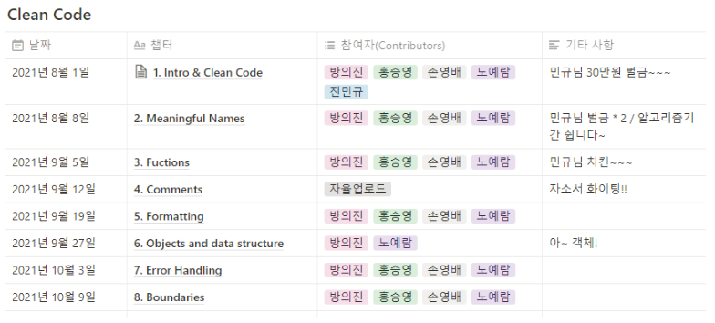

# README

> 💡 영어와 개발 용어와 친해지기
>
> 💡 누구나 언제나 중도참여 가능! 디스코드 구경 가능 🙂!!
>
> 💡 Clean-Code 원서 읽고 정리✨

### 스터디 진행방향 😎

- 한 챕터씩 읽고 9시에 모여서 (읽기 전 생각 - 읽는 중 - 읽은 후 느낀점) 나누기
- 예시) **주 1회 한 챕터를** 읽고 **느낀 점**, **모르는 점**, 새로 **알게된** 거? 그런거 공유
- 하나의 깃헙에 챕터별 폴더 만들어서, **TIL 올리기 (50분에)**
- **부담 갖지 말고** 간단하게 중 고등학생한테 설명하듯이 간단하게
- 최대한 원서로 볼 것! (나도 영어 싫음)

